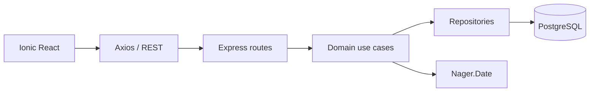

# Arquitectura de la Solucion

## Objetivo

La estructura separa reglas de negocio, adaptadores, presentacion e
infraestructura. Sigue la organizacion por funcionalidades del proyecto guia
CoffeeEcommerce sin introducir dependencias innecesarias.

## Frontend

```text
src/
|-- core/
|   |-- config/
|   |-- data/http/
|   `-- presentation/
|       |-- components/
|       |-- hooks/
|       |-- router/
|       `-- theme/
`-- features/
    |-- auth/
    |-- solicitudes/
    |-- agenda/
    |-- dashboard/
    |-- notificaciones/
    |-- reportes/
    `-- landing/
```

- `domain`: entidades, contratos y casos de uso puros.
- `data`: Axios, localStorage y adaptadores externos.
- `composition`: construccion de servicios con sus dependencias.
- `presentation`: pantallas Ionic y estilos.

## Backend

```text
municipalidad-backend/src/
|-- core/
|   |-- config/
|   |-- database/
|   |-- http/middleware/
|   |-- security/
|   `-- server/
`-- features/
    |-- auth/
    |-- solicitudes/
    `-- feriados/
```

Las rutas HTTP dependen de casos de uso y repositorios. Las contrasenas y JWT
se resuelven mediante servicios de `core/security`. PostgreSQL se accede con
parametros posicionales y columnas explicitas.

## Flujo principal



## Decisiones relevantes

- Registro publico siempre crea ciudadanos.
- JWT protege solicitudes, agenda y feriados.
- La asignacion de funcionarios equilibra solicitudes activas.
- Los codigos usan la secuencia de PostgreSQL y no `MAX(id)+1`.
- Indices parciales impiden citas activas duplicadas.
- Las pantallas se cargan bajo demanda.
- El build moderno evita duplicar toda la aplicacion para ES5.
