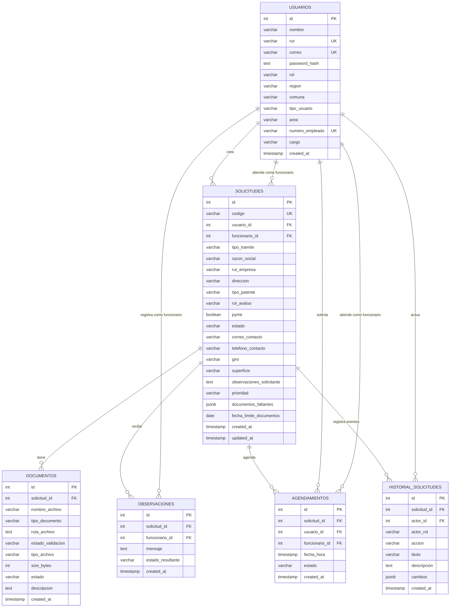

# Modelo relacional - Municipalidad App

## Descripción general

El sistema utiliza una base de datos relacional en PostgreSQL para gestionar usuarios, solicitudes municipales, documentos asociados, observaciones realizadas por funcionarios y agendamientos de atención.

El modelo relacional fue diseñado considerando la trazabilidad de las solicitudes ciudadanas, la diferenciación de roles entre usuarios y funcionarios, y la integridad referencial entre las entidades principales del sistema.

## Diagrama relacional



## Entidades principales

### usuarios

Tabla encargada de almacenar los datos de las personas registradas en el sistema.

Incluye tanto usuarios ciudadanos como funcionarios municipales. La diferenciación se realiza mediante el campo `rol`, que permite controlar permisos y accesos dentro de la aplicación.

Campos relevantes:

- `id`: identificador único del usuario.
- `rut`: identificador único nacional del usuario.
- `correo`: correo electrónico único.
- `password_hash`: contraseña almacenada como hash.
- `rol`: define si el usuario es `usuario` o `funcionario`.
- `numero_empleado`: identificador interno para funcionarios.
- `cargo`: cargo del funcionario municipal.

### solicitudes

Tabla central del sistema. Almacena las solicitudes municipales creadas por los usuarios ciudadanos.

Campos relevantes:

- `id`: identificador único de la solicitud.
- `codigo`: código único de seguimiento.
- `usuario_id`: usuario ciudadano que crea la solicitud.
- `funcionario_id`: funcionario asignado o responsable de la revisión.
- `tipo_tramite`: tipo de trámite municipal.
- `estado`: estado actual de la solicitud.
- `prioridad`: prioridad asignada a la solicitud.
- `documentos_faltantes`: lista de documentos pendientes.
- `fecha_limite_documentos`: fecha límite para entregar documentación.

### documentos

Tabla encargada de almacenar los documentos asociados a una solicitud.

Campos relevantes:

- `id`: identificador único del documento.
- `solicitud_id`: solicitud a la que pertenece el documento.
- `nombre_archivo`: nombre del archivo subido.
- `tipo_documento`: clasificación del documento.
- `ruta_archivo`: ubicación del archivo en el servidor.
- `estado_validacion`: estado de revisión del documento.
- `tipo_archivo`: tipo MIME del archivo.
- `size_bytes`: tamaño del archivo.
- `descripcion`: descripción del documento.

### observaciones

Tabla utilizada para registrar comentarios u observaciones realizadas por funcionarios sobre una solicitud.

Campos relevantes:

- `id`: identificador único de la observación.
- `solicitud_id`: solicitud asociada.
- `funcionario_id`: funcionario que registra la observación.
- `mensaje`: contenido de la observación.
- `estado_resultante`: estado de la solicitud luego de la observación.

### agendamientos

Tabla encargada de registrar fechas de atención o revisión asociadas a una solicitud.

Campos relevantes:

- `id`: identificador único del agendamiento.
- `solicitud_id`: solicitud asociada.
- `usuario_id`: usuario ciudadano relacionado al agendamiento.
- `funcionario_id`: funcionario asignado.
- `fecha_hora`: fecha y hora de atención.
- `estado`: estado del agendamiento.

### historial_solicitudes

Tabla de auditoría que conserva los eventos relevantes sin reconstruirlos desde
el estado actual.

Campos relevantes:

- `solicitud_id`: solicitud afectada.
- `actor_id` y `actor_rol`: persona o sistema que ejecutó la acción.
- `accion`: creación, cambio de estado, documentos o derivación.
- `titulo` y `descripcion`: explicación visible del evento.
- `cambios`: valores anteriores y nuevos almacenados como JSONB.

## Relaciones del modelo

### usuarios - solicitudes

Un usuario ciudadano puede crear muchas solicitudes.

Relación:

```text
usuarios.id -> solicitudes.usuario_id
```

Cardinalidad:

```text
1 usuario puede tener 0..N solicitudes
1 solicitud pertenece a 1 usuario
```

Además, un funcionario puede estar asignado a muchas solicitudes.

Relación:

```text
usuarios.id -> solicitudes.funcionario_id
```

Cardinalidad:

```text
1 funcionario puede atender 0..N solicitudes
1 solicitud puede tener 0..1 funcionario asignado
```

### solicitudes - documentos

Una solicitud puede tener muchos documentos asociados.

Relación:

```text
solicitudes.id -> documentos.solicitud_id
```

Cardinalidad:

```text
1 solicitud puede tener 0..N documentos
1 documento pertenece a 1 solicitud
```

### solicitudes - observaciones

Una solicitud puede recibir muchas observaciones.

Relación:

```text
solicitudes.id -> observaciones.solicitud_id
```

Cardinalidad:

```text
1 solicitud puede tener 0..N observaciones
1 observación pertenece a 1 solicitud
```

### usuarios - observaciones

Un funcionario puede registrar muchas observaciones.

Relación:

```text
usuarios.id -> observaciones.funcionario_id
```

Cardinalidad:

```text
1 funcionario puede registrar 0..N observaciones
1 observación puede tener 0..1 funcionario asociado
```

### solicitudes - agendamientos

Una solicitud puede tener uno o más agendamientos asociados.

Relación:

```text
solicitudes.id -> agendamientos.solicitud_id
```

Cardinalidad:

```text
1 solicitud puede tener 0..N agendamientos
1 agendamiento pertenece a 1 solicitud
```

### usuarios - agendamientos

Un usuario ciudadano puede tener muchos agendamientos.

Relación:

```text
usuarios.id -> agendamientos.usuario_id
```

Además, un funcionario puede estar asociado a muchos agendamientos.

Relación:

```text
usuarios.id -> agendamientos.funcionario_id
```

## Validación de integridad

La base de datos implementa validaciones de integridad mediante restricciones propias de PostgreSQL.

### Claves primarias

Cada tabla posee una clave primaria `id`, lo que permite identificar de forma única cada registro.

Tablas con clave primaria:

- `usuarios`
- `solicitudes`
- `documentos`
- `observaciones`
- `agendamientos`

### Claves únicas

Se utilizan restricciones `UNIQUE` para evitar datos duplicados en campos críticos:

- `usuarios.rut`
- `usuarios.correo`
- `usuarios.numero_empleado`
- `solicitudes.codigo`

### Claves foráneas

Se utilizan claves foráneas para asegurar la relación entre entidades:

- `solicitudes.usuario_id` referencia a `usuarios.id`
- `solicitudes.funcionario_id` referencia a `usuarios.id`
- `documentos.solicitud_id` referencia a `solicitudes.id`
- `observaciones.solicitud_id` referencia a `solicitudes.id`
- `observaciones.funcionario_id` referencia a `usuarios.id`
- `agendamientos.solicitud_id` referencia a `solicitudes.id`
- `agendamientos.usuario_id` referencia a `usuarios.id`
- `agendamientos.funcionario_id` referencia a `usuarios.id`

### Reglas de eliminación

El modelo utiliza reglas `ON DELETE` para mantener la consistencia de los datos:

- `ON DELETE CASCADE`: si se elimina una solicitud, se eliminan sus documentos, observaciones y agendamientos asociados.
- `ON DELETE CASCADE`: si se elimina un usuario ciudadano, se eliminan sus solicitudes y agendamientos asociados.
- `ON DELETE SET NULL`: si se elimina un funcionario, las solicitudes, observaciones o agendamientos asociados conservan el registro, pero el campo del funcionario queda nulo.

### Restricciones CHECK

Se utilizan restricciones `CHECK` para limitar los valores permitidos en campos como:

- `usuarios.rol`
- `solicitudes.estado`
- `documentos.estado_validacion`
- `observaciones.estado_resultante`
- `agendamientos.estado`

Esto permite evitar estados inválidos y mantener consistencia en los flujos del sistema.

## Implementación en PostgreSQL

El modelo relacional está implementado en PostgreSQL mediante archivos SQL incluidos en el repositorio.

Archivos principales:

```text
municipalidad-backend/src/db/schema.sql
database/municipalidad_db_con_datos.sql
```

El archivo `schema.sql` contiene la estructura limpia de la base de datos.

El archivo `municipalidad_db_con_datos.sql` corresponde a una exportación de la base utilizada durante el desarrollo y contiene estructura junto con datos de prueba.

Para importar la base de datos con datos de prueba:

```bash
psql -U postgres -d municipalidad_app -f database/municipalidad_db_con_datos.sql
```

Para crear solo la estructura limpia:

```bash
psql -U postgres -d municipalidad_app -f municipalidad-backend/src/db/schema.sql
```
